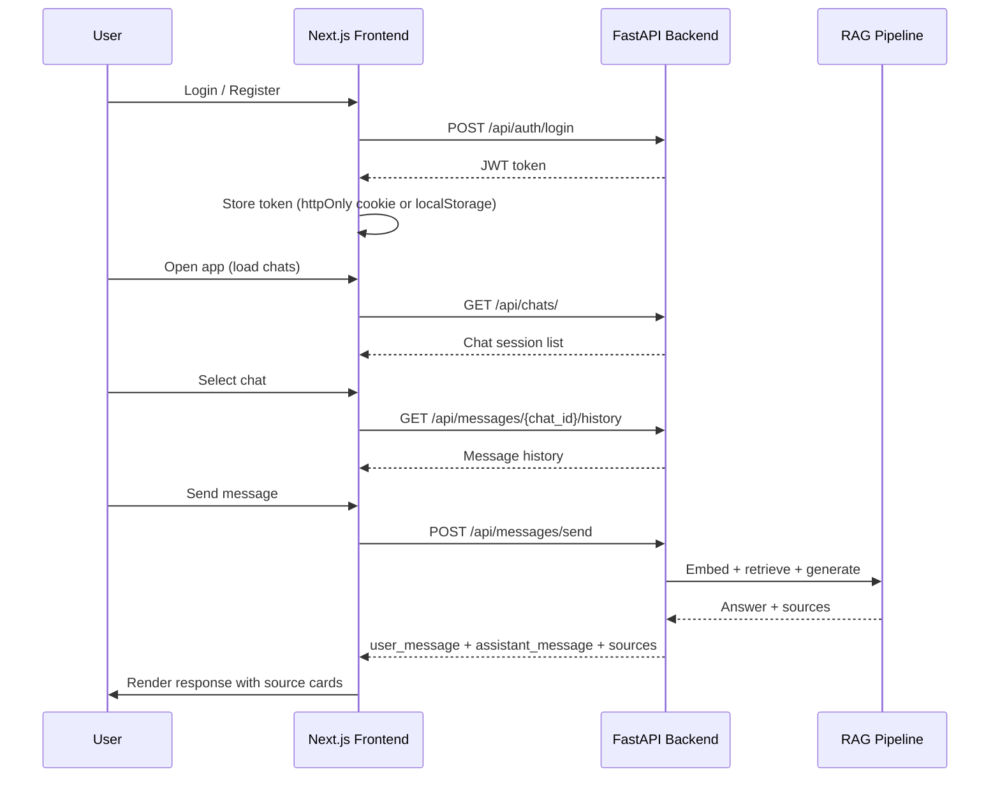

# Frontend–Backend Integration Plan: RAG Researcher

## Overview

The `FE_from_v0` directory contains a Vercel v0-generated Next.js 16 frontend for the RAG Researcher application. It is visually complete but entirely driven by mock data. This spec describes the plan to refine the UI and wire it to the existing FastAPI backend.

The backend exposes a REST API at `/api` (default port `8000`) with JWT Bearer authentication, chat sessions, RAG-powered messaging, and source ingestion (PDF + YouTube).

---

## Current State Analysis

### Frontend (`FE_from_v0`)


| Area                                     | Status                              |
| ---------------------------------------- | ----------------------------------- |
| UI components                            | ✅ Complete (shadcn/ui, Tailwind v4) |
| Chat layout (sidebar + messages + input) | ✅ Complete                          |
| Source cards display                     | ✅ Complete                          |
| Auth (login / register)                  | ❌ Missing                           |
| API client / HTTP layer                  | ❌ Missing                           |
| Real chat session management             | ❌ Mock only                         |
| Real message send / RAG response         | ❌ Mock streaming simulation         |
| Source management UI                     | ❌ Missing                           |
| Token storage & refresh                  | ❌ Missing                           |
| Error handling / toasts                  | ❌ Missing                           |


### Backend API (key endpoints)


| Endpoint                              | Purpose                                            |
| ------------------------------------- | -------------------------------------------------- |
| `POST /api/auth/login`                | Get JWT token (form: `username`=email, `password`) |
| `POST /api/users/`                    | Register new user                                  |
| `GET /api/auth/me`                    | Get current user                                   |
| `GET /api/chats/`                     | List user's chat sessions                          |
| `POST /api/chats/`                    | Create new chat session                            |
| `POST /api/messages/send`             | Send message → RAG response + sources              |
| `GET /api/messages/{chat_id}/history` | Load message history                               |
| `POST /api/sources/upload`            | Upload PDF                                         |
| `POST /api/sources/youtube`           | Add YouTube URL                                    |
| `GET /api/sources/`                   | List user's sources                                |
| `POST /api/sources/{id}/process`      | Trigger ingestion                                  |


---

## Architecture



---

## Proposed Frontend Structure

The existing `FE_from_v0` folder will be restructured to add:

```
FE_from_v0/
├── app/
│   ├── (auth)/
│   │   ├── login/page.tsx        ← NEW
│   │   └── register/page.tsx     ← NEW
│   ├── (app)/
│   │   ├── layout.tsx            ← NEW (auth guard)
│   │   └── page.tsx              ← REFACTORED (real data)
│   └── layout.tsx
├── lib/
│   ├── api/
│   │   ├── client.ts             ← NEW (fetch wrapper + auth headers)
│   │   ├── auth.ts               ← NEW
│   │   ├── chats.ts              ← NEW
│   │   ├── messages.ts           ← NEW
│   │   └── sources.ts            ← NEW
│   ├── types.ts                  ← UPDATED (align with backend schemas)
│   └── mock-data.ts              ← REMOVED
├── components/
│   ├── auth/
│   │   ├── login-form.tsx        ← NEW
│   │   └── register-form.tsx     ← NEW
│   ├── sources/
│   │   └── source-manager.tsx    ← NEW (upload PDF / add YouTube)
│   └── chat/                     ← REFACTORED (real data)
└── hooks/
    ├── use-auth.ts               ← NEW
    ├── use-chats.ts              ← NEW
    └── use-messages.ts           ← NEW
```

---

## Key Design Decisions

### 1. Auth Token Storage

Store the JWT in `localStorage` for simplicity (the backend does not issue httpOnly cookies). An `Authorization: Bearer <token>` header is attached to every protected request via the API client wrapper.

### 2. No Streaming from Backend

The backend's `POST /api/messages/send` returns a **complete** response (not a stream). The existing word-by-word streaming animation in the frontend can be preserved as a **UI-only effect** — receive the full answer, then animate it character-by-character client-side.

### 3. Type Alignment

The frontend `Message` type needs to be extended to carry the backend `id` (UUID) and `chat_id`. The `ChatSession` type needs `user_id` and `collections`. The `Source` type needs `type`, `status`, `collection_name`, and `user_id` fields from `SourceRead`.

### 4. Source Management Panel

A new slide-over / sheet panel accessible from the sidebar will allow users to upload PDFs, add YouTube URLs, view ingestion status, and link sources to the active chat session.

---

## Wireframes

### Login / Register Page

```wireframe
<!DOCTYPE html>
<html>
<head>
<style>
  * { box-sizing: border-box; margin: 0; padding: 0; font-family: system-ui, sans-serif; }
  body { background: #0f0f0f; color: #e5e5e5; display: flex; align-items: center; justify-content: center; min-height: 100vh; }
  .card { background: #1a1a1a; border: 1px solid #2a2a2a; border-radius: 16px; padding: 40px; width: 380px; }
  .logo { display: flex; align-items: center; gap: 10px; margin-bottom: 28px; }
  .logo-icon { width: 36px; height: 36px; background: #6366f1; border-radius: 10px; display: flex; align-items: center; justify-content: center; font-size: 18px; }
  .logo-text { font-size: 18px; font-weight: 600; }
  h2 { font-size: 22px; font-weight: 600; margin-bottom: 6px; }
  .subtitle { font-size: 13px; color: #888; margin-bottom: 28px; }
  .field { margin-bottom: 16px; }
  label { display: block; font-size: 12px; color: #aaa; margin-bottom: 6px; }
  input { width: 100%; padding: 10px 14px; background: #111; border: 1px solid #333; border-radius: 8px; color: #e5e5e5; font-size: 14px; outline: none; }
  input:focus { border-color: #6366f1; }
  .btn-primary { width: 100%; padding: 11px; background: #6366f1; color: #fff; border: none; border-radius: 8px; font-size: 14px; font-weight: 500; cursor: pointer; margin-top: 8px; }
  .divider { text-align: center; font-size: 12px; color: #555; margin: 20px 0; }
  .link { text-align: center; font-size: 13px; color: #888; }
  .link a { color: #6366f1; text-decoration: none; }
  .tabs { display: flex; gap: 4px; background: #111; border-radius: 8px; padding: 4px; margin-bottom: 24px; }
  .tab { flex: 1; text-align: center; padding: 8px; border-radius: 6px; font-size: 13px; cursor: pointer; color: #888; }
  .tab.active { background: #1a1a1a; color: #e5e5e5; font-weight: 500; }
</style>
</head>
<body>
<div class="card">
  <div class="logo">
    <div class="logo-icon">✦</div>
    <span class="logo-text">Nexus</span>
  </div>
  <div class="tabs">
    <div class="tab active" data-element-id="tab-login">Sign In</div>
    <div class="tab" data-element-id="tab-register">Register</div>
  </div>
  <h2>Welcome back</h2>
  <p class="subtitle">Sign in to your account to continue</p>
  <div class="field">
    <label>Email address</label>
    <input type="email" placeholder="you@example.com" data-element-id="input-email" />
  </div>
  <div class="field">
    <label>Password</label>
    <input type="password" placeholder="••••••••" data-element-id="input-password" />
  </div>
  <button class="btn-primary" data-element-id="btn-login">Sign In</button>
  <div class="link" style="margin-top:16px;">Don't have an account? <a href="#">Register</a></div>
</div>
</body>
</html>
```

### Main Chat View (with Sources Panel)

```wireframe
<!DOCTYPE html>
<html>
<head>
<style>
  * { box-sizing: border-box; margin: 0; padding: 0; font-family: system-ui, sans-serif; }
  body { background: #0f0f0f; color: #e5e5e5; display: flex; height: 100vh; overflow: hidden; }
  .sidebar { width: 240px; background: #111; border-right: 1px solid #222; display: flex; flex-direction: column; padding: 12px; gap: 8px; }
  .sidebar-header { display: flex; align-items: center; justify-content: space-between; padding: 4px 4px 8px; border-bottom: 1px solid #222; margin-bottom: 4px; }
  .logo { display: flex; align-items: center; gap: 8px; font-weight: 600; font-size: 14px; }
  .logo-icon { width: 28px; height: 28px; background: #6366f1; border-radius: 8px; display: flex; align-items: center; justify-content: center; font-size: 14px; }
  .new-chat-btn { display: flex; align-items: center; gap: 6px; padding: 8px 10px; background: rgba(99,102,241,0.1); border: 1px solid rgba(99,102,241,0.2); border-radius: 8px; font-size: 13px; color: #6366f1; cursor: pointer; }
  .chat-item { padding: 7px 10px; border-radius: 6px; font-size: 12px; color: #aaa; cursor: pointer; white-space: nowrap; overflow: hidden; text-overflow: ellipsis; }
  .chat-item.active { background: #1e1e2e; color: #e5e5e5; }
  .section-label { font-size: 10px; color: #555; text-transform: uppercase; letter-spacing: 0.08em; padding: 4px 10px; margin-top: 8px; }
  .sources-btn { margin-top: auto; display: flex; align-items: center; gap: 6px; padding: 8px 10px; border-radius: 8px; font-size: 12px; color: #888; cursor: pointer; border: 1px solid #2a2a2a; }
  .main { flex: 1; display: flex; flex-direction: column; }
  .messages { flex: 1; overflow-y: auto; padding: 24px; display: flex; flex-direction: column; gap: 16px; max-width: 720px; margin: 0 auto; width: 100%; }
  .msg-user { display: flex; gap: 10px; align-items: flex-start; }
  .msg-ai { display: flex; gap: 10px; align-items: flex-start; }
  .avatar { width: 28px; height: 28px; border-radius: 50%; background: #2a2a2a; border: 1px solid #333; display: flex; align-items: center; justify-content: center; font-size: 12px; flex-shrink: 0; }
  .avatar.ai { background: rgba(99,102,241,0.15); border-color: rgba(99,102,241,0.3); }
  .bubble { background: #1a1a1a; border: 1px solid #2a2a2a; border-radius: 14px; padding: 12px 16px; font-size: 13px; line-height: 1.6; max-width: 580px; }
  .sources-row { display: flex; gap: 6px; flex-wrap: wrap; margin-bottom: 6px; }
  .source-chip { display: flex; align-items: center; gap: 4px; padding: 3px 8px; background: #1a1a1a; border: 1px solid #2a2a2a; border-radius: 6px; font-size: 11px; color: #aaa; }
  .input-area { padding: 12px 24px 16px; border-top: 1px solid #1e1e1e; }
  .input-box { max-width: 720px; margin: 0 auto; background: #1a1a1a; border: 1px solid #2a2a2a; border-radius: 14px; padding: 12px 14px; display: flex; align-items: flex-end; gap: 8px; }
  .input-box textarea { flex: 1; background: transparent; border: none; outline: none; color: #e5e5e5; font-size: 13px; resize: none; min-height: 24px; }
  .send-btn { width: 32px; height: 32px; background: #6366f1; border-radius: 10px; display: flex; align-items: center; justify-content: center; cursor: pointer; flex-shrink: 0; }
  .panel { width: 320px; background: #111; border-left: 1px solid #222; display: flex; flex-direction: column; padding: 16px; gap: 12px; }
  .panel-title { font-size: 14px; font-weight: 600; padding-bottom: 10px; border-bottom: 1px solid #222; }
  .upload-zone { border: 1px dashed #333; border-radius: 10px; padding: 20px; text-align: center; font-size: 12px; color: #666; }
  .source-item { display: flex; align-items: center; gap: 8px; padding: 8px; background: #1a1a1a; border-radius: 8px; border: 1px solid #2a2a2a; }
  .source-icon { width: 28px; height: 28px; background: #222; border-radius: 6px; display: flex; align-items: center; justify-content: center; font-size: 12px; flex-shrink: 0; }
  .source-info { flex: 1; min-width: 0; }
  .source-name { font-size: 12px; white-space: nowrap; overflow: hidden; text-overflow: ellipsis; }
  .source-status { font-size: 10px; color: #4ade80; }
  .status-processing { color: #f59e0b; }
</style>
</head>
<body>
<div class="sidebar">
  <div class="sidebar-header">
    <div class="logo"><div class="logo-icon">✦</div> Nexus</div>
  </div>
  <div class="new-chat-btn" data-element-id="btn-new-chat">+ New chat</div>
  <div class="section-label">Today</div>
  <div class="chat-item active" data-element-id="chat-item-1">How does RAG work?</div>
  <div class="chat-item" data-element-id="chat-item-2">History of LLMs</div>
  <div class="section-label">Yesterday</div>
  <div class="chat-item" data-element-id="chat-item-3">Vector DB comparison</div>
  <div class="sources-btn" data-element-id="btn-sources">📎 Manage Sources</div>
</div>

<div class="main">
  <div class="messages">
    <div class="msg-user">
      <div class="avatar">U</div>
      <div class="bubble">How does retrieval-augmented generation work?</div>
    </div>
    <div class="msg-ai">
      <div class="avatar ai">✦</div>
      <div style="flex:1; max-width:580px;">
        <div class="sources-row">
          <div class="source-chip">① arxiv.org</div>
          <div class="source-chip">② pinecone.io</div>
          <div class="source-chip">③ langchain.com</div>
        </div>
        <div class="bubble">RAG combines a retrieval step with generation. Your query is embedded, matched against a vector store, and the top chunks are injected as context before the LLM generates an answer. [1][2][3]</div>
      </div>
    </div>
  </div>
  <div class="input-area">
    <div class="input-box">
      <textarea placeholder="Ask a follow-up question..." data-element-id="chat-input" rows="1"></textarea>
      <div class="send-btn" data-element-id="btn-send">↑</div>
    </div>
  </div>
</div>

<div class="panel">
  <div class="panel-title">📎 Sources</div>
  <div class="upload-zone" data-element-id="upload-zone">
    Drop PDF here or click to upload<br/>
    <span style="font-size:10px; margin-top:4px; display:block;">Max 20 MB · PDF only</span>
  </div>
  <div style="font-size:12px; color:#666; text-align:center;">— or —</div>
  <input style="width:100%; padding:8px 12px; background:#1a1a1a; border:1px solid #2a2a2a; border-radius:8px; color:#e5e5e5; font-size:12px; outline:none;" placeholder="YouTube URL..." data-element-id="input-youtube" />
  <div style="font-size:11px; color:#555; font-weight:600; text-transform:uppercase; letter-spacing:0.06em;">Your Sources</div>
  <div class="source-item">
    <div class="source-icon">📄</div>
    <div class="source-info">
      <div class="source-name">RAG Paper 2024.pdf</div>
      <div class="source-status">● Ready</div>
    </div>
  </div>
  <div class="source-item">
    <div class="source-icon">▶</div>
    <div class="source-info">
      <div class="source-name">Andrej Karpathy LLM talk</div>
      <div class="source-status status-processing">● Processing…</div>
    </div>
  </div>
</div>
</body>
</html>
```

---

## Implementation Phases


| Phase | Ticket                  | Scope                                                         |
| ----- | ----------------------- | ------------------------------------------------------------- |
| 1     | API Client & Types      | HTTP wrapper, token management, aligned TypeScript types      |
| 2     | Auth Pages              | Login + Register pages, auth guard layout                     |
| 3     | Chat Wiring             | Real chat sessions, message history, send message via backend |
| 4     | Source Management       | Upload PDF, add YouTube, list sources, trigger processing     |
| 5     | Polish & Error Handling | Loading states, toasts, empty states, error boundaries        |


---

## Backend Compatibility Notes

- **Login form:** The backend uses `OAuth2PasswordRequestForm` — the request must be `application/x-www-form-urlencoded` with `username` (email) and `password` fields.
- **Chat creation:** `POST /api/chats/` requires `user_id` in the body matching the authenticated user's UUID.
- **Message send:** Returns a full response (not a stream). The `sources` array contains chunk metadata dicts, not the `Source` schema — the frontend must map these to displayable source cards.
- **CORS:** Backend already allows `http://localhost:3000` via `CORS_ORIGINS`.
- **API prefix:** All routes are under `/api` (configurable via `API_PREFIX` env var).

&nbsp;