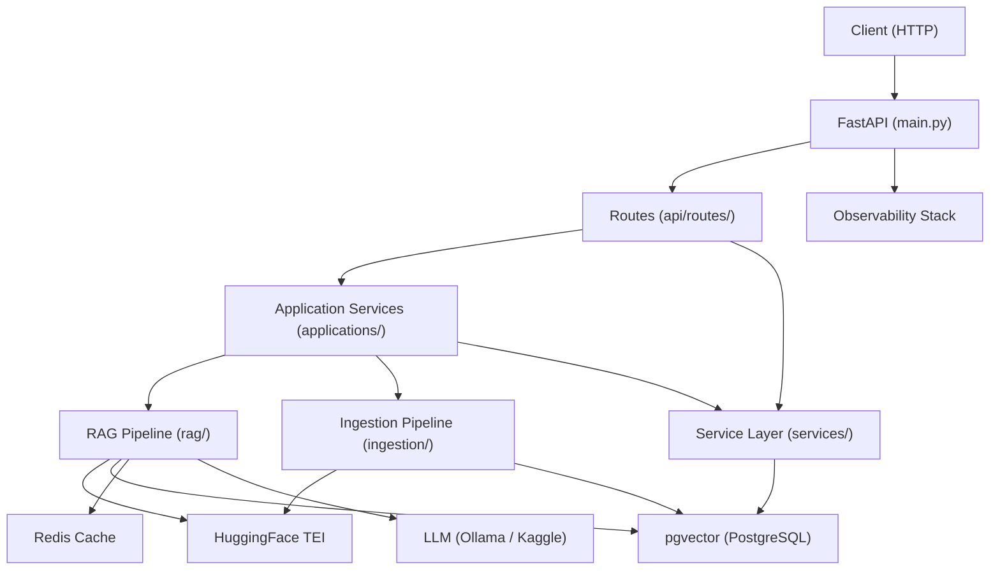

# RAG Researcher

> Conversational AI over PDF and YouTube sources

  

RAG Researcher is a production-ready Retrieval-Augmented Generation (RAG) system with a FastAPI backend and a Next.js frontend. Users can upload PDF documents or YouTube video URLs, ingest them into a pgvector store, and ask questions via a conversational chat interface. The LangChain LCEL pipeline handles multi-turn chat history, Redis-cached embeddings, and supports both Ollama and Kaggle LitServe as interchangeable LLM backends.

## Architecture Overview



## Quickstart

```bash
# 1. Start all services
docker-compose up -d

# 2. Copy and configure environment
cp .env.example .env
# Edit .env — set SECRET_KEY, POSTGRES_PASSWORD, TEI_URL at minimum

# 3. Run database migrations
docker-compose exec rag-app alembic upgrade head

# 3.5. Open the frontend app
# http://localhost:3000

# 4. Register a user and get a token
curl -X POST http://localhost:8000/api/users \
  -H "Content-Type: application/json" \
  -d '{"email":"user@example.com","password":"secret"}'

curl -X POST http://localhost:8000/api/auth/login \
  -F "username=user@example.com" \
  -F "password=secret"

# 5. Query the RAG system (replace TOKEN with the access_token from step 4)
curl -X POST http://localhost:8000/api/rag/query \
  -H "Authorization: Bearer TOKEN" \
  -H "Content-Type: application/json" \
  -d '{"question":"What is RAG?","collection_name":"documents"}'
```

## Key Features

- **RAG pipeline** — LCEL-based async pipeline with multi-turn chat history, LLM response caching, and configurable `top_k` retrieval
- **Multi-source ingestion** — PDF (via pypdf) and YouTube (via youtube-transcript-api) with smart re-ingestion (content-hash deduplication)
- **Chat history** — per-session conversation context persisted in PostgreSQL, trimmed to `CHAT_HISTORY_MAX_TURNS`
- **Redis caching** — embedding and LLM response caches with separate TTLs (`CACHE_TTL_EMBEDDINGS`, `CACHE_TTL_LLM`), graceful degradation when Redis is unavailable
- **Observability stack** — Prometheus metrics, OpenTelemetry traces (Tempo), structured JSON logs (Loki), pre-provisioned Grafana dashboards
- **LLM provider switching** — set `LLM_PROVIDER=ollama` (default) or `LLM_PROVIDER=kaggle` to switch backends without code changes

## Documentation

| Document | Description |
|---|---|
| [docs/architecture.md](docs/architecture.md) | System components, data flow diagrams, technology choices |
| [docs/deployment.md](docs/deployment.md) | Docker Compose services, environment variables, LLM provider switching |
| [docs/api-reference.md](docs/api-reference.md) | All REST endpoints with request/response schemas |
| [docs/observability.md](docs/observability.md) | Metrics, dashboards, alert rules, trace/log correlation |
| [docs/contributing.md](docs/contributing.md) | Local dev setup, test structure, code conventions |
| [backend/docs/backend-architecture.md](backend/docs/backend-architecture.md) | Backend layer diagram, DI patterns, async patterns |

### Rate Limiting

The API implements sliding window rate limiting to protect against abuse. Configure via environment variables:

```bash
# Rate Limiting Configuration
RATE_LIMIT_ENABLED=true                    # Enable/disable rate limiting (default: true)
RATE_LIMIT_PER_MINUTE=60                   # Maximum requests per minute per user (default: 60)
RATE_LIMIT_WINDOW_SECONDS=60               # Time window in seconds (default: 60)
RATE_LIMIT_CLEANUP_INTERVAL=300            # Cleanup interval for old entries in seconds (default: 300)
```

**Rate limit behavior:**
- Authenticated requests are limited per user (extracted from JWT token)
- Unauthenticated requests are limited per IP address
- When exceeded, API returns HTTP 429 with `Retry-After` header
- All responses include rate limit headers: `X-RateLimit-Limit`, `X-RateLimit-Remaining`, `X-RateLimit-Reset`

**Recommended values:**
- **Development**: `RATE_LIMIT_PER_MINUTE=300` (higher limit for testing)
- **Production**: `RATE_LIMIT_PER_MINUTE=60` (balanced protection)
- **Strict**: `RATE_LIMIT_PER_MINUTE=30` (high-security environments)

## Observability

The API includes a complete observability stack powered by **Grafana**, **Prometheus**, **Tempo**, and **Loki** for metrics, traces, and logs.

### Quick Access

- **Frontend App**: `http://localhost:3000`
- **Grafana Dashboards**: `http://localhost:3002` (default credentials: `admin` / `admin`)
- **Prometheus**: `http://localhost:9090`
- **Tempo**: `http://localhost:3200` (traces backend)
- **Loki**: `http://localhost:3100` (logs backend)

### Configuration

```bash
# Metrics
ENABLE_METRICS=true
METRICS_SLOW_QUERY_THRESHOLD_MS=100

# Tracing (OpenTelemetry → Tempo)
ENABLE_TRACING=true
OTEL_SERVICE_NAME=rag-researcher
OTEL_EXPORTER_TYPE=otlp
OTLP_ENDPOINT=http://tempo:4317
OTEL_TRACE_SAMPLE_RATE=1.0

# Logging (Structured logs → Loki)
LOKI_ENABLED=true
LOKI_ENDPOINT=http://loki:3100
```

### Pre-built Grafana Dashboards

All dashboards are auto-provisioned on startup:

1. **RAG Pipeline Performance** (`/d/rag_pipeline`)
   - Query rate by status (success/failure/empty)
   - End-to-end latency (P50/P95/P99)
   - Retrieval vs Generation time breakdown
   - Embedding generation latency
   - LLM cache hit rate
   - Generation latency by model

2. **API Performance** (`/d/api_performance`)
   - Request rate by endpoint
   - P95 latency per route
   - HTTP status code distribution (2xx/3xx/4xx/5xx)
   - Active concurrent requests
   - Error rate gauge
   - Top 10 slowest endpoints

3. **Database & Cache Performance** (`/d/db_cache`)
   - Query rate by operation (SELECT/INSERT/UPDATE/DELETE)
   - Query latency P95 by table
   - Connection pool utilization
   - Cache hit rate by type (embeddings/LLM)
   - Cache operation latency
   - Slow queries visualization

4. **System Overview** (`/d/system_overview`)
   - High-level health metrics (request rate, error rate, P95 latency, cache hit rate)
   - RAG pipeline health summary
   - Database health indicators
   - Recent error logs from Loki

5. **Error Tracking** (`/d/error_tracking`)
   - API error rate by endpoint
   - Error count by HTTP status code
   - RAG failure rate by collection
   - Ingestion failures
   - Recent error logs with trace correlation
   - Error traces with clickable links to Tempo
   - Top errors by type and count

### Trace & Log Correlation

- **Metrics → Traces**: Click exemplar dots in dashboard charts to view related traces
- **Traces → Logs**: Click "Logs for this span" in Tempo trace view to see correlated logs
- **Logs → Traces**: Click trace ID links in Loki logs to jump to trace timeline
- All logs contain `trace_id` and `span_id` fields for correlation

### Prometheus Alerts

Active alerting rules with thresholds optimized for RAG workloads:

**API Alerts:**
- `HighErrorRate`: 5xx errors > 5% for 2 minutes
- `HighP95Latency`: P95 latency > 2s for 5 minutes
- `HighActiveRequests`: Active requests > 100 for 5 minutes

**RAG Alerts:**
- `RAGHighFailureRate`: Failure rate > 10% for 3 minutes
- `RAGHighLatency`: P95 latency > 5s for 5 minutes
- `RAGEmptyResults`: Empty results > 30% for 5 minutes
- `LLMGenerationSlow`: P95 generation time > 10s for 5 minutes

**Database Alerts:**
- `DatabaseSlowQueries`: Fast queries (< 100ms) < 80% for 5 minutes
- `DatabasePoolExhaustion`: Connection pool > 90% utilized for 3 minutes
- `DatabaseHighErrorRate`: Write operations failing for 5 minutes

**Cache Alerts:**
- `LowCacheHitRate`: Hit rate < 50% for 10 minutes
- `CacheOperationsSlow`: P95 latency > 100ms for 5 minutes

**Ingestion Alerts:**
- `IngestionFailureRate`: Failure rate > 20% for 5 minutes
- `EmbeddingGenerationSlow`: P95 generation time > 1s for 5 minutes

View active alerts in Prometheus UI at `http://localhost:9090/alerts`

### Metrics Endpoint

- Prometheus scrape: `GET /metrics`
- Health check includes observability status: `GET /health`

### Key Metrics

- `http_request_duration_seconds`: API latency histograms (p50/p95/p99)
- `rag_query_duration_seconds`: End-to-end RAG latency
- `rag_retrieval_duration_seconds`: Vector search duration
- `rag_generation_duration_seconds`: LLM response time
- `embedding_generation_duration_seconds`: Embedding latency by provider
- `cache_operations_total{result="hit|miss"}`: Cache hit/miss counters
- `database_query_duration_seconds`: Database query performance
- `database_pool_size` / `database_pool_checked_out`: Connection pool metrics
- `active_requests`: Current in-flight HTTP requests
- `ingestion_jobs_total{status="success|failure"}`: Ingestion metrics

### Example Prometheus Queries

```promql
# API request rate
rate(http_requests_total[5m])

# API error rate
rate(http_requests_total{status_code=~"5.."}[5m])

# RAG p95 latency
histogram_quantile(0.95, rate(rag_query_duration_seconds_bucket[5m]))

# Cache hit rate
rate(cache_operations_total{result="hit"}[5m]) / rate(cache_operations_total[5m])

# Slow DB queries (>100ms)
rate(database_query_duration_seconds_bucket{le="0.1"}[5m])
```

### Starting the Stack

```bash
# Start all services (app, postgres, redis, prometheus, tempo, loki, grafana)
docker-compose up -d

# View logs
docker-compose logs -f grafana
docker-compose logs -f prometheus

# Stop all services
docker-compose down
```

### Troubleshooting

**Grafana not showing data:**
- Check Prometheus is scraping: `http://localhost:9090/targets` (rag-app should be UP)
- Verify datasources: Grafana → Configuration → Data Sources (all should be green)
- Generate test traffic: Make API requests to `/api/v1/rag/query`

**Traces not appearing:**
- Check Tempo health: `docker-compose logs tempo`
- Verify OTLP endpoint: `docker-compose logs rag-app | grep "trace"`
- Check trace sampling rate: `OTEL_TRACE_SAMPLE_RATE=1.0` (set to 100%)

**Logs missing in Loki:**
- Check Loki ingestion: `docker-compose logs loki`
- Verify Loki handler: Look for "python-logging-loki" import errors
- Ensure JSON logging: Logs must be JSON format for proper parsing

**Dashboard panels showing "No data":**
- Wait 30-60 seconds after startup for metrics to populate
- Make API requests to generate metrics
- Check time range in dashboard (default: last 1 hour)

## Commit Readiness Checklist

Run these checks before committing:

```bash
# Backend tests
pytest -q

# Frontend dependencies + lint
pnpm -C frontend install
pnpm -C frontend lint
```

Current known blockers discovered in this repo state:

- Backend test collection fails due to `pytest_plugins` being declared in `backend/tests/conftest.py` (Pytest deprecation for non-top-level conftest).
- Frontend lint command exists but `eslint` is not currently available in `frontend/package.json` devDependencies.

