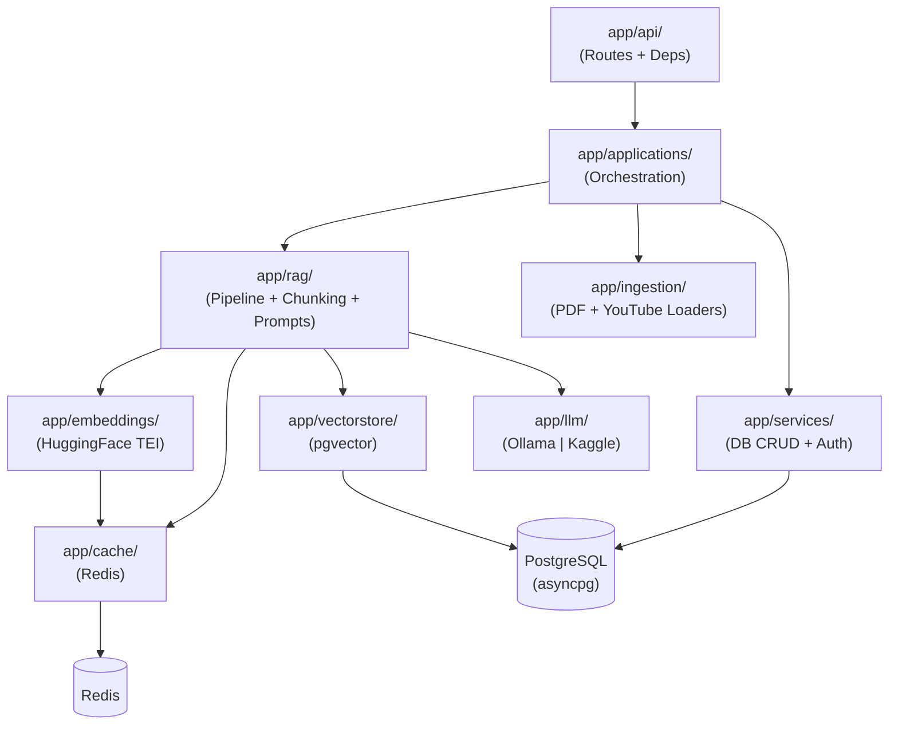
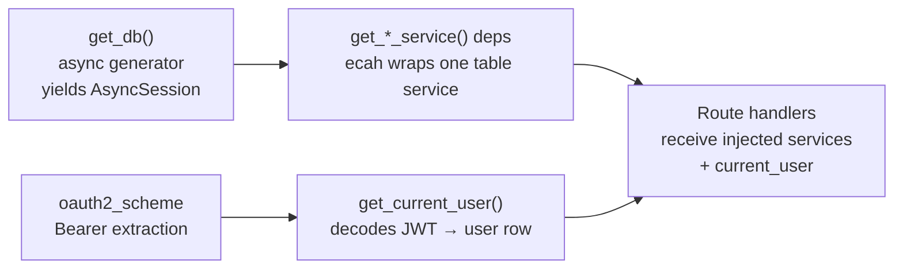
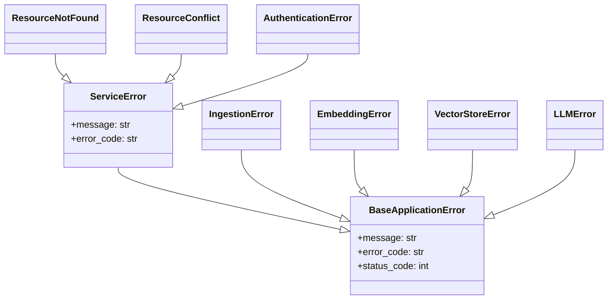

# Backend Architecture

Internal technical reference for the `backend/` package.  Covers layer responsibilities, dependency-injection wiring, exception hierarchy, async patterns, caching strategy, and LLM provider abstraction.

---

## Table of Contents

1. [Layer Map](#1-layer-map)
2. [Dependency-Injection Chain](#2-dependency-injection-chain)
3. [Exception Hierarchy](#3-exception-hierarchy)
4. [Async Patterns](#4-async-patterns)
5. [LLM Provider Abstraction](#5-llm-provider-abstraction)
6. [Smart Re-ingestion Logic](#6-smart-re-ingestion-logic)
7. [Redis Caching Strategy](#7-redis-caching-strategy)
8. [Rate Limiting](#8-rate-limiting)

---

## 1. Layer Map



| Layer | Responsibility |
|---|---|
| `api/` | FastAPI routers, OAuth2 bearer extraction, FastAPI dependency functions |
| `applications/` | Use-case orchestrators; owns transaction scope; coordinates services, RAG and ingestion |
| `services/` | Single-table CRUD and domain auth logic; raises `ServiceError` subclasses |
| `rag/` | LangChain LCEL chain, text chunking, prompt templates |
| `ingestion/` | Source-format extraction (PDF via `pypdf`, YouTube via `youtube-transcript-api`) |
| `embeddings/` | HTTP client for self-hosted HuggingFace TEI; batched with Redis caching |
| `vectorstore/` | Raw `asyncpg` pgvector queries (cosine similarity, CRUD) |
| `cache/` | Generic Redis get/set wrapper with namespaced keys and TTL |
| `llm/` | Provider-specific LangChain `BaseChatModel` implementations |
| `middleware/` | ASGI middleware: request-ID injection, Prometheus + OpenTelemetry observability |
| `observability/` | Prometheus metric definitions and OTel span-attribute helpers |
| `core/` | App factory, `Settings` (pydantic-settings), structlog config, lifespan |
| `db/` | SQLAlchemy async ORM models, Pydantic schemas, session factory |

---

## 2. Dependency-Injection Chain



Key points:

- `get_db()` in `api/deps.py` uses `async with db_session()` to yield an `AsyncSession` and roll back on error.
- Every service dependency (`get_auth_service`, `get_user_service`, …) constructs a service object with the injected session; this keeps services stateless.
- `get_current_user` calls `AuthService.validate_token` which decodes the JWT and fetches the user row — one DB round-trip per authenticated request.
- The `Depends` graph is evaluated lazily by FastAPI; teardown (session close) happens after the response is sent.

---

## 3. Exception Hierarchy



HTTP mapping (set in `main.py` exception handlers):

| Exception | HTTP Status |
|---|---|
| `ResourceNotFound` | 404 |
| `ResourceConflict` | 409 |
| `AuthenticationError` | 401 |
| `IngestionError` | 422 |
| `EmbeddingError` | 503 |
| `VectorStoreError` | 503 |
| `LLMError` | 503 |

---

## 4. Async Patterns

### `AsyncSession` (SQLAlchemy)

All database operations use `AsyncSession` with `asyncpg` as the driver.  Session lifecycle is managed by `get_db()` in `api/deps.py`.  Service methods call `await session.execute(...)` and `await session.commit()`.

### `asyncio.wait_for` — LLM timeout

`RAGPipeline._generate_answer` wraps the LangChain chain invocation with `asyncio.wait_for(chain.ainvoke(...), timeout=settings.LLM_TIMEOUT_SECONDS)`.  On `asyncio.TimeoutError` the method raises `LLMError`.

### `asyncio.to_thread` — Blocking I/O

`IngestionApplication.process_source` runs the synchronous PDF/YouTube extraction functions via `asyncio.to_thread(extract_from_pdf, ...)` and `asyncio.to_thread(extract_from_youtube, ...)` so that the event loop is never blocked.

### HTTP Clients

`HuggingFaceTEIEmbedder` opens a persistent `httpx.AsyncClient` at startup and reuses it for all embedding batches.  `KaggleChatModel._agenerate` creates a new `httpx.AsyncClient` per call (justified by the infrequent Kaggle invocation pattern).

---

## 5. LLM Provider Abstraction

The active provider is controlled by `settings.LLM_PROVIDER` (`.env`):

```
LLM_PROVIDER=ollama   # default — local Ollama container
LLM_PROVIDER=kaggle   # Kaggle LitServe via HTTP tunnel
```

`RAGPipeline.__init__` builds the LangChain `BaseChatModel` based on this value:

```python
if settings.LLM_PROVIDER == "kaggle":
    llm = KaggleChatModel(api_url=settings.KAGGLE_LLM_URL, ...)
else:
    llm = ChatOllama(model=settings.LLM_MODEL, ...)
```

Both providers implement `BaseChatModel._agenerate` so the LCEL chain (`prompt | llm | parser`) is identical for both.  Adding a new provider requires only a new `BaseChatModel` subclass and a branch in `RAGPipeline.__init__`.

---

## 6. Smart Re-ingestion Logic

`IngestionApplication.process_source` avoids redundant work using a two-level hash check:

```
┌─────────────────────────────────────────┐
│           process_source(source_id)     │
└─────────────┬───────────────────────────┘
              │
              ▼
   Load source row from DB
              │
              ▼ PDF path?
   ┌──────────┴──────────┐
   │ Compute file hash   │   YouTube: compute content hash
   │ (SHA-256 of bytes)  │   (SHA-256 of joined segment text)
   └──────────┬──────────┘
              │
              ▼
   hash == stored hash? ──YES──► return "skipped" (no chunks deleted)
              │
             NO
              │
              ▼
   Delete existing chunks for source
   Extract content
   Chunk content
   Generate embeddings
   Insert new chunks
   Update stored hash
   Return "ingested"
```

All writes happen inside a single `AsyncSession` transaction; if any step raises, the session rolls back automatically.

---

## 7. Redis Caching Strategy

Two cache namespaces are used; both degrade gracefully (cache miss = live computation, Redis errors are logged and swallowed):

| Namespace | Key pattern | TTL | Populated by |
|---|---|---|---|
| Embedding docs | `embedding:doc:{sha256_hex}` | 3 600 s | `HuggingFaceTEIEmbedder.embed_documents` |
| Embedding queries | `embedding:query:{sha256_hex}` | 3 600 s | `HuggingFaceTEIEmbedder.embed_query` |
| LLM responses | `llm:{model}:{sha256_hex}` | 1 800 s | `RAGPipeline._generate_answer` |

Keys are generated by `RedisCache._make_key(namespace, *parts)` which joins parts with `:` and prefixes with the namespace — ensuring no collisions between cache types.

Graceful degradation flow:

```
try:
    cached = await cache.get(key)
    if cached: return cached
    result = await live_call()
    await cache.set(key, result, ttl)
    return result
except RedisError:
    logger.warning("cache unavailable, falling back to live call")
    return await live_call()
```

---

## 8. Rate Limiting

`RateLimitMiddleware` (in `app/middleware/`) implements an **in-process sliding-window** rate limiter:

- Per-IP request counts are stored in a plain `dict` protected by a `threading.Lock`.
- Each entry stores a deque of timestamps; entries outside the window are evicted on every check.
- Default: **60 requests / 60 seconds** per IP (configurable via `settings.RATE_LIMIT_REQUESTS` and `settings.RATE_LIMIT_WINDOW_SECONDS`).
- Requests that exceed the limit receive `HTTP 429 Too Many Requests`.

> **Note:** This implementation is suitable for single-process deployments.  For multi-replica deployments, replace the in-memory store with a Redis-backed sliding window (e.g. using `redis-py` sorted sets).
