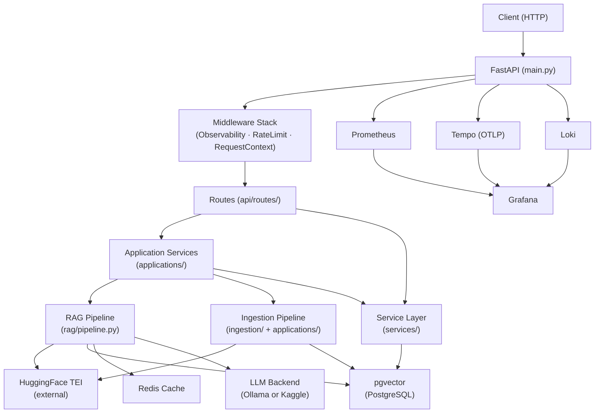
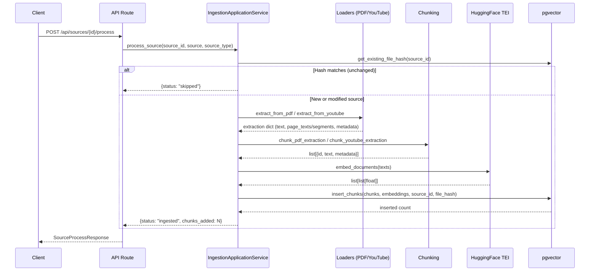
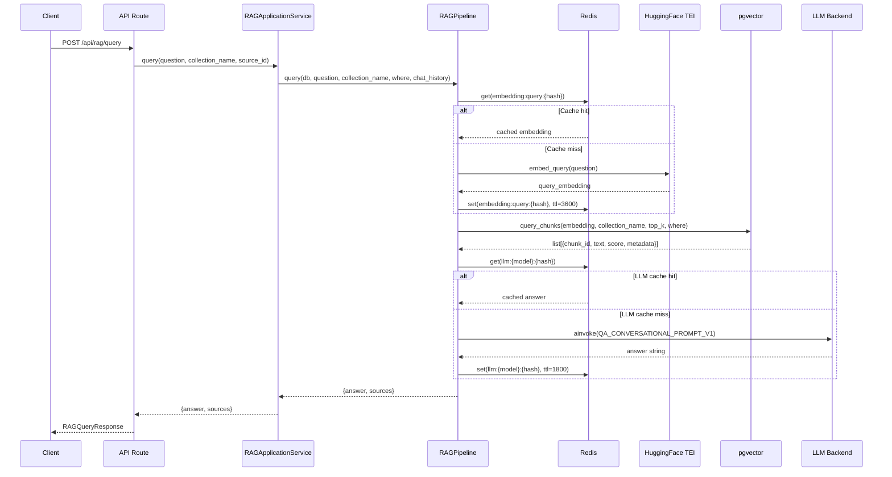

# Architecture

## System Overview

RAG Researcher is composed of the following major components:

| Component | Role |
|---|---|
| **FastAPI app** | Async HTTP API, middleware chain, lifespan management |
| **Application Services** | Orchestration layer that composes lower-level services into use-case workflows |
| **RAG Pipeline** | LangChain LCEL chain for query embedding → vector retrieval → LLM generation |
| **Ingestion Pipeline** | Extraction → chunking → embedding → pgvector insert with hash deduplication |
| **pgvector (PostgreSQL)** | Persistent vector store and relational data (users, chats, sources, chunks) |
| **Redis** | TTL-based cache for embeddings and LLM responses |
| **HuggingFace TEI** | Self-hosted text embeddings inference server |
| **Ollama / Kaggle LitServe** | Interchangeable LLM backends, selected by `LLM_PROVIDER` env var |
| **Observability Stack** | Prometheus + Tempo (OTLP) + Loki + Grafana for metrics, traces, and logs |

## Component Diagram

## Ingestion Flow

## RAG Query Flow

## Technology Choices

| Component | Technology | Reason |
|---|---|---|
| API framework | FastAPI | Async-native, auto OpenAPI docs |
| LLM orchestration | LangChain LCEL | Composable async chains |
| Vector store | pgvector (PostgreSQL) | No extra infra, SQL joins |
| Embeddings | HuggingFace TEI | Self-hosted, batched |
| LLM | Ollama / Kaggle LitServe | Switchable via `LLM_PROVIDER` |
| Cache | Redis | Embedding + LLM response TTL |
| Observability | Prometheus + Tempo + Loki + Grafana | Full metrics/traces/logs |
| ORM | SQLAlchemy (async) + asyncpg | Native async with pgvector support |
| Settings | pydantic-settings | Env var validation with `.env` |
